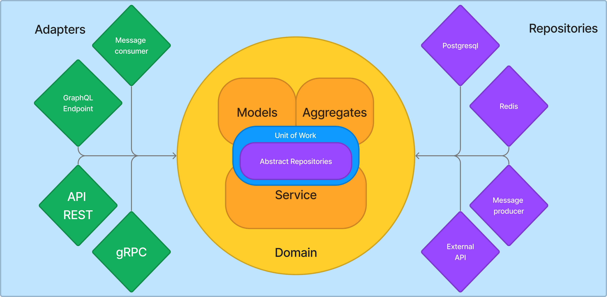

## Domain Driven Development ?

Domain-Driven Development (DDD) is a software development approach that emphasizes the importance of understanding and modeling the core business domain within a software application.

It places the domain, which represents the problem space and the business logic, at the center of the development process. DDD encourages collaboration between domain experts and software developers to create a shared understanding of the domain and its complexities. This approach advocates for using domain-specific language and concepts to shape the software's architecture and design, resulting in more maintainable, flexible, and business-aligned software systems.



Overall, DDD helps teams build software that better reflects the intricacies of the real-world business problems they are solving.

This sounds like DDD can be amazing but it is also a complex approach to software development, because its core is composed by multiple terms that needs to be detailled and understood.

## The Domain explained

The domain is the core of your application.
It's a space where only the business logic lives. By business logic, we mean the logic that is specific to your application, and not the logic that is specific to the framework or the infrastructure you are using.

Everything is abstraction in DDD, so the domain is an abstraction of the real world.
It's a space where you can model your business logic, and where you can use the language of your business, without having to think about the technical details.

```python
# This is a technical approach
user_repository = UserRepository()
return user_repository.filter_by_birth_date(date(1987, 1, 1))

# This is a business approach
users = Users()
return users.born_in(1987)
```

A Domain is split into multiple objects that have a specific role:

- **Services**: A Service are the entry point of your application. It meant to hold all the business logic for a part of your application.
Services are meant to be only business logic and abstractions. They should not be aware of the infrastructure or the framework you are using.

```python
class RegistrationService(Service):
    def register_user(self, user_id: int):
        ...

    def unregister_user(self, user_id: int):
        ...
```

Services are meant to be used with what we call an `UnitOfWork`

- **UnitOfWork**: A UnitOfWork is an object that will handle the external dependencies of your application. It will handle the databases connections, a global transaction, and the `Repository` objects.

```python
class AbstractUserUnitOfWork(UnitOfWork):
    users: AbstractUserRepository
    events: AbstractEventRepository
```

- **Repository**: A Repository is an object that will handle the persistence of your data. It will handle the database queries, and the data transformation.
In the domain, Repositories are abstract. It represented only the contract to fullfill to be able to persist data and query it.

```python
class AbstractUserRepository(AbstractRepository):
    def get_by_id(self, user_id: int) -> User:
        ...

    def get_by_email(self, email: str) -> User:
        ...
    
    def save(self, user: dict) -> User:
        ...

    def create(self, user: dict) -> User:
        ...
```

- **Models**: Models are the representation of your data. Those will be the objects that will be used in your services and your business logic.

```python
class User(Entity):
    id: int
    email: str
    first_name: str
    last_name: str
    birth_date: date

class UserCreate(DTO):
    email: str
    first_name: str
    last_name: str
    birth_date: date
```

Notice that there's several types of Model objects that have their own role. That can be seen in the next sections

### Ubiquitous Language

Before going further, we need to talk about the **Ubiquitous Language**.

DDD is meant to conceal what the business want to do, and how it's done.
It's a language that is shared between the business and the developers.
It's a language that is specific to your business, and that is used everywhere in your application.

So, in the domain, you should use the language of your business, and not the technical terms.

```python
# Bad Language
def update(self, user_id: int, user: UserUpdate) -> User:
    ...

# Good Language
def register_user(self, user_id: int) -> User:
    ...

```

### Services

As we wrote earlier, a `Service` in DDD is the entry point of your application. This object holds what you need to interact with your business logic and your data.

Writing a `Service` should embeds all the necessary methods to interact with your business logic. It should not be aware of the framework or the infrastructure you are using.
Also, no need to be technical at this point. You can use the language of your business, and the technical details will be handled by the `UnitOfWork` object.

This philosophy is directly opposed to the CRUD approach, where your models have all the methods needed to interact with the database.
In DDD, your models are only data representation, and the business logic is handled by the `Service` object.

```python
# Bad Service
class UserService(Service):
    def create_user(self, user: UserCreate) -> User:
        ...

    def get_user(self, user_id: int) -> User:
        ...

    def update_user(self, user_id: int, user: UserUpdate) -> User:
        ...

    def delete_user(self, user_id: int) -> None:
        ...

# Good Service
class UserService(Service):
    def create_user(self, user: UserCreate) -> User:
        ...

    def register_user(self, user_id: int) -> User:
        ...

    def unregister_user(self, user_id: int) -> User:
        ...
```

Yes, I know... There's a `create_user` method in both examples. This is a part of the CRUD approach too, but business speaking, create is not the same as register.
But, tell me how you can register a user in both examples ?

The point here is, create / get / update / delete are all technical terms. They are not the language of your business, they are ambiguous.

That's the first part of DDD, called the **Ubiquitous Language**. It's a language that is shared between the business and the developers. It's a language that is specific to your business, and that is used everywhere in your application.

### Unit Of Work

### Repositories

### Entities
